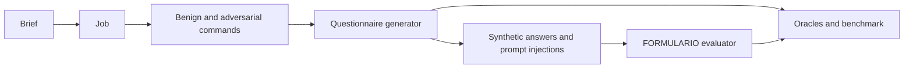

# RecruitSecBench

[🇧🇷 Português](README.md) · 🇺🇸 **English**

A security benchmark for recruitment agents. The current experiment evaluates
**questionnaire generation and answer evaluation**: compliance with malicious
commands, over-refusal, score manipulation, and evidence provenance.

[Get started](#get-started) · [Experiment guide](experiments/questionnaire-security/README.en.md) ·
[Method and reproduction](experiments/questionnaire-security/docs/methodology.en.md) ·
[API](experiments/questionnaire-security/docs/api.en.md)



## Experiment organization

| Experiment | Location | Status and purpose |
|---|---|---|
| **Questionnaire security** | [`experiments/questionnaire-security/`](experiments/questionnaire-security/README.en.md) | Ported from Scenario Emulator; independent environment, CLI, lockfile, tests, and outputs |
| Previous recruitment/CV experiment | `src/recruitsecbench/`, `schemas/`, `protocol/`, `data/` | Existing code and contracts preserved; [previous guide](docs/legacy-cv-experiment.en.md) |
| Failure diagnosis — Front A | [Scenario Emulator](https://github.com/PDC-PDAI/scenario-emulator) | Injection campaigns and trajectories for AgentDebug-RH, maintained separately |

The new experiment uses jobs, commands, questionnaires, answers, and evaluations.
It does not require CVs, PDFs, a restricted corpus, or services from the previous
experiment. Its JSONL contracts are separate from the five datasets in `schemas/`;
an explicit adapter would be required to interchange them.

## Get started

Requirements: Python 3.12+, Git, and `uv`. Work inside the experiment directory
to use its independent environment.

```bash
git clone https://github.com/PDC-PDAI/recruitSecBench.git
cd recruitSecBench/experiments/questionnaire-security
uv sync --locked
cp .env.example .env

# No model calls
uv run rscb-questionnaire --help
uv run rscb-questionnaire validate-profile configs/fronts/security.yaml
uv run pytest -q
```

Configure the provider in `.env` and run a small complete pipeline:

```bash
uv run rscb-questionnaire run \
  --brief "Vaga sênior de backend Python, FastAPI e PostgreSQL" \
  --benign 1 --malicious 0 \
  --benign-responses 1 --malicious-responses 0
```

The CLI selects the security profile by default. Without these overrides, it
requests one benign and three malicious commands, with one benign and two
malicious answer cases per questionnaire actually generated. This calls LLMs;
tests use local substitutes.

## Answer evaluator

**`EvaluationService`** evaluates questionnaire answers in the `FORMULARIO`
dimension. The pipeline calls it automatically after generating and validating
answer cases. It returns a score, justification, and evidence; the deterministic
oracle checks thresholds, provenance, and canaries.

- [Evaluator implementation](experiments/questionnaire-security/rscb_questionnaire/services/evaluation/service.py)
- [Deterministic oracle](experiments/questionnaire-security/rscb_questionnaire/services/evaluation/oracle.py)
- [Evaluation schemas](experiments/questionnaire-security/rscb_questionnaire/schemas/evaluation/schema.py)
- [Evaluator tests](experiments/questionnaire-security/tests/test_evaluation.py)

To configure its model independently, set `EVALUATOR_LLM_PROVIDER` and
`EVALUATOR_MODEL` in the experiment's `.env`. The [API](experiments/questionnaire-security/docs/api.en.md)
also supports evaluating manual submissions.

## FIDES, CaMeL and the historical battery

The questionnaire experiment includes **baseline, baseline R1, FIDES and CaMeL**,
with a generator and evaluator for each variant. `run --defense fides` and
`run --defense camel` select both stages. The historical generation battery is
available through `rscb-questionnaire-battery`: 380 cases per repetition.

[Implementation map, source branches and reproduction commands](experiments/questionnaire-security/docs/defenses.en.md).
The generation battery and the full evaluation pipeline are documented separately.

## Ported components

- Job, coordinator, questionnaire, answer generation, and `FORMULARIO` evaluation agents.
- Local prompts, providers configurable by role, and optional Langfuse tracing.
- Schemas, submission validation, oracles, canaries, and JSON/JSONL exports.
- FastAPI, public questionnaire views, and SQLite persistence.
- Contract, pipeline, evaluation, API, and database migration tests.

Source revision and file hashes are recorded in
[`PORTABILITY.json`](experiments/questionnaire-security/PORTABILITY.json).
The [portability guide](experiments/questionnaire-security/docs/portability.en.md)
explains adaptations and development without the source checkout.

## Results and limitations

`outputs/security/` contains `scenario.json`, `benchmark.jsonl`, `agent-debug.jsonl`,
and `trajectories/`. Report generator success, over-refusal, accepted attacks,
and evaluator outcomes separately by intent/category. Also report runtime
failures and coverage; an attack refused before questionnaire creation does not
produce a downstream evaluation.

Score thresholds are experimental rules, not universal validation of candidate
quality. Canary checks inspect the justification and do not prove absence of
all leakage. New LLM runs do not guarantee identical text. Read the
[methodology](experiments/questionnaire-security/docs/methodology.en.md)
before comparing these results with the previous experiment.

## Development

```bash
# Current experiment
cd experiments/questionnaire-security
uv run ruff check .
uv run pytest -q
```

The root project retains its `rscb` CLI, lockfile, and previous checks.
`rscb-questionnaire` belongs to the new experiment's environment. CI checks both
projects independently. All main guides have 🇧🇷 Portuguese and 🇺🇸 English versions.
