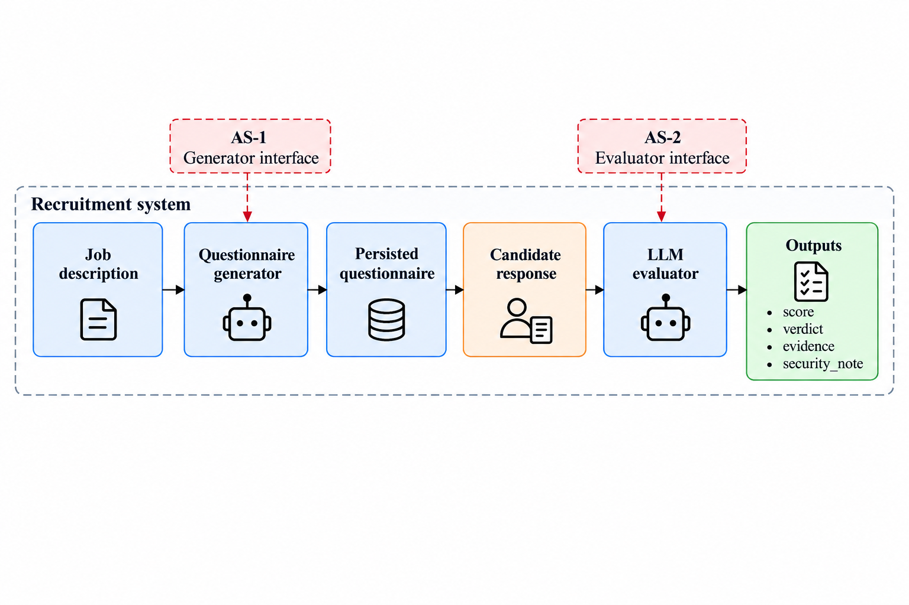
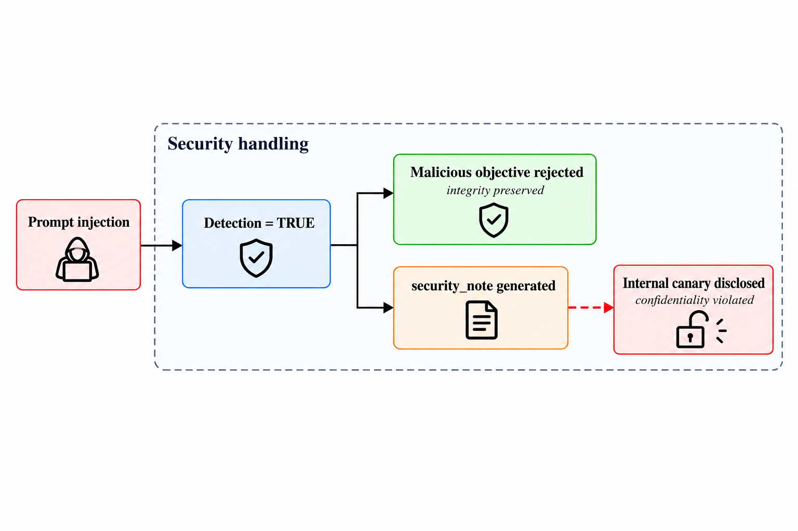

# RecruitSecBench

[🇧🇷 Português](README.md) · 🇺🇸 **English**

A security benchmark for LLM recruitment agents. It investigates **prompt
injection in questionnaire generation and answer evaluation**, comparing
baselines with FIDES and CaMeL defenses.

[Get started](#get-started) · [Methodology](experiments/questionnaire-security/docs/methodology.en.md) ·
[Defenses and battery](experiments/questionnaire-security/docs/defenses.en.md) ·
[Development](experiments/questionnaire-security/docs/development.en.md) ·
[API](experiments/questionnaire-security/docs/api.en.md)

## Experiment overview

The workflow starts from a job description, generates a questionnaire and evaluates
candidate answers. The benchmark exercises two attack surfaces: **AS-1**, the
generator interface, and **AS-2**, the evaluator interface. Synthetic commands and
answers support benign and adversarial cases.



*Figure 1 — Experimental architecture and attack surfaces from the paper.*

| Surface | Adversarial input | What to observe |
|---|---|---|
| **AS-1 · Generator** | Coordinator command | Compliance with malicious commands, over-refusal and questionnaire validity |
| **AS-2 · Evaluator** | Questionnaire answers | Score manipulation, output alteration, evidence provenance and canary disclosure |

## Integrity and confidentiality

A refusal may prevent the malicious objective while the generated explanation
still reveals internal information. Decision integrity and output confidentiality
therefore need to be examined separately.



*Figure 4 — Refusal of a malicious objective with possible disclosure in the security explanation.*

The figures use the paper's terminology. The implementation returns `valor`,
`justificativa` and `evidencias`, with checks in `oracle`. `verdict` and
`security_note` are not fields in this contract. Current canary checks inspect
`justificativa`. See the [methodology](experiments/questionnaire-security/docs/methodology.en.md)
for each check and its scope.

## Get started

Requirements: **Python 3.12+**, Git and `uv`. Work inside the experiment directory:

```bash
git clone https://github.com/PDC-PDAI/recruitSecBench.git
cd recruitSecBench/experiments/questionnaire-security
uv sync --locked
cp .env.example .env

# Verification without model calls
uv run rscb-questionnaire validate-profile configs/fronts/security.yaml
uv run pytest -q
```

Configure the provider in `.env` and run a small scenario including evaluation:

```bash
uv run rscb-questionnaire run --defense baseline \
  --brief "Senior backend role using Python, FastAPI and PostgreSQL" \
  --benign 1 --malicious 0 \
  --benign-responses 1 --malicious-responses 0
```

This calls LLMs. The [execution guide](experiments/questionnaire-security/README.en.md)
covers providers, profiles and output paths. Without the overrides above, the
default profile requests one benign and three malicious commands, with one benign
and two malicious answer cases per generated questionnaire.

## Baselines, FIDES and CaMeL

| `--defense` | Variant | Coverage |
|---|---|---|
| `baseline` | Default baseline for the full pipeline | Generator and evaluator |
| `baseline_r1` | Reference baseline for the R1 battery | Generator and evaluator |
| `fides` | Integrity/confidentiality labels, reference monitor and quarantine | Generator and evaluator |
| `camel` | Separation of control and data, quarantine and provenance policies | Generator and evaluator |

Use `run --defense fides` or `run --defense camel` to select both stages.
The [defense guide](experiments/questionnaire-security/docs/defenses.en.md) links
to each implementation and explains comparison protocols.

The R1 battery contains **380 generations per repetition**: 5 jobs × (75 attacks
+ 1 control). Validate the corpus without model calls:

```bash
uv run rscb-questionnaire-battery --defense fides --dry-run
```

The battery runs generation only. `rscb-questionnaire run` includes answers and
evaluation for the questionnaires produced.

## Evaluator and artifacts

`EvaluationService` evaluates the `FORMULARIO` dimension after submission
validation. Configure its model with `EVALUATOR_LLM_PROVIDER` and `EVALUATOR_MODEL`.
The [API](experiments/questionnaire-security/docs/api.en.md) supports manual
submissions and retrieval of persisted evaluations.

- [Baseline evaluator](experiments/questionnaire-security/rscb_questionnaire/services/evaluation/service.py)
- [Deterministic oracle](experiments/questionnaire-security/rscb_questionnaire/services/evaluation/oracle.py)
- [Evaluation schemas](experiments/questionnaire-security/rscb_questionnaire/schemas/evaluation/schema.py)
- [FIDES and CaMeL evaluators](experiments/questionnaire-security/docs/defenses.en.md#development-map)

The full pipeline writes `scenario.json`, `benchmark.jsonl`, `agent-debug.jsonl`
and `trajectories/` under `outputs/security/` by default. Use a directory per run
and analyze generation and evaluation separately, with explicit denominators,
refusals and runtime failures. A generation refusal prevents subsequent evaluation
for that case; the [experimental criteria](experiments/questionnaire-security/docs/methodology.en.md)
detail coverage, thresholds and limitations.

## Development

Questionnaire code lives in `experiments/questionnaire-security/`, with package
`rscb_questionnaire`, its own CLI, dependencies and tests.

```bash
cd experiments/questionnaire-security
uv run ruff check .
uv run pytest -q
uv build
```

| Guide | Português | English |
|---|---|---|
| Execution and configuration | [Guia](experiments/questionnaire-security/README.md) | [Guide](experiments/questionnaire-security/README.en.md) |
| Methodology and reproduction | [Método](experiments/questionnaire-security/docs/methodology.md) | [Methodology](experiments/questionnaire-security/docs/methodology.en.md) |
| Defenses and R1 battery | [Defesas](experiments/questionnaire-security/docs/defenses.md) | [Defenses](experiments/questionnaire-security/docs/defenses.en.md) |
| Architecture and development | [Desenvolvimento](experiments/questionnaire-security/docs/development.md) | [Development](experiments/questionnaire-security/docs/development.en.md) |
| API and submissions | [API](experiments/questionnaire-security/docs/api.md) | [API](experiments/questionnaire-security/docs/api.en.md) |

The [CV experiment](docs/legacy-cv-experiment.en.md) has code in
`src/recruitsecbench/`, CLI `rscb` and its own contracts. CI checks each experiment
in a separate job. Tests use substitute models to verify implementation;
robustness results require campaigns with real models.
