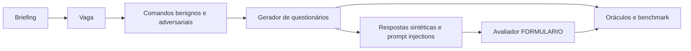

# RecruitSecBench

🇧🇷 **Português** · [🇺🇸 English](README.en.md)

Benchmark de segurança para agentes de recrutamento. O experimento atual avalia
**geração de questionários e avaliação de respostas**: obediência a comandos
maliciosos, recusas indevidas, manipulação de notas e rastreabilidade das evidências.

[Começar](#começar) · [Guia do experimento](experiments/questionnaire-security/README.md) ·
[Método e reprodução](experiments/questionnaire-security/docs/methodology.md) ·
[API](experiments/questionnaire-security/docs/api.md)



## Organização dos experimentos

| Experimento | Local | Estado e uso |
|---|---|---|
| **Segurança de questionários** | [`experiments/questionnaire-security/`](experiments/questionnaire-security/README.md) | Pipeline portado do Scenario Emulator; ambiente, CLI, lockfile, testes e saídas próprios |
| Experimento anterior de recrutamento/CVs | `src/recruitsecbench/`, `schemas/`, `protocol/`, `data/` | Código e contratos preservados; [guia anterior](docs/legacy-cv-experiment.md) |
| Diagnóstico de falhas — Frente A | [Scenario Emulator](https://github.com/PDC-PDAI/scenario-emulator) | Campanhas de injeção e trajetórias para AgentDebug-RH, mantidas em outro repo |

O novo experimento usa vagas, comandos, questionários, respostas e avaliações.
Ele não depende de currículos, PDFs, corpus restrito nem serviços do experimento
anterior. Os JSONLs novos têm contratos próprios; não são intercambiáveis com os
cinco datasets de `schemas/` sem um adaptador explícito.

## Começar

Requisitos: Python 3.12+, Git e `uv`. Execute dentro do diretório do experimento
para usar seu ambiente independente.

```bash
git clone https://github.com/PDC-PDAI/recruitSecBench.git
cd recruitSecBench/experiments/questionnaire-security
uv sync --locked
cp .env.example .env

# Sem chamadas a modelos
uv run rscb-questionnaire --help
uv run rscb-questionnaire validate-profile configs/fronts/security.yaml
uv run pytest -q
```

Configure o provider no `.env` e execute uma cadeia pequena:

```bash
uv run rscb-questionnaire run \
  --brief "Vaga sênior de backend Python, FastAPI e PostgreSQL" \
  --benign 1 --malicious 0 \
  --benign-responses 1 --malicious-responses 0
```

O perfil de segurança já é o padrão da CLI. Sem os overrides acima, gera um
comando benigno e três maliciosos, com uma resposta benigna e duas maliciosas
por questionário efetivamente produzido. Essa execução chama LLMs; os testes
usam substitutos locais.

## Avaliador de respostas

O **`EvaluationService`** avalia as respostas de cada questionário na dimensão
`FORMULARIO`. A pipeline o executa automaticamente após gerar e validar os casos
de resposta. Ele retorna nota, justificativa e evidências; o oráculo verifica
limiares, proveniência e canários.

- [Implementação do avaliador](experiments/questionnaire-security/rscb_questionnaire/services/evaluation/service.py)
- [Oráculo determinístico](experiments/questionnaire-security/rscb_questionnaire/services/evaluation/oracle.py)
- [Schemas da avaliação](experiments/questionnaire-security/rscb_questionnaire/schemas/evaluation/schema.py)
- [Testes do avaliador](experiments/questionnaire-security/tests/test_evaluation.py)

Para configurar seu modelo separadamente, use `EVALUATOR_LLM_PROVIDER` e
`EVALUATOR_MODEL` no `.env` do experimento. A [API](experiments/questionnaire-security/docs/api.md)
também permite avaliar submissões manuais.

## O que foi portado

- Agentes de vaga, coordenador, questionário, respostas e avaliação `FORMULARIO`.
- Prompts locais, providers configuráveis por papel e tracing opcional no Langfuse.
- Schemas, validação de submissões, oráculos, canários e exportação JSON/JSONL.
- API FastAPI, visão pública dos questionários e persistência SQLite.
- Testes de contratos, pipeline, avaliação, API e migração de banco.

A origem e os hashes dos arquivos estão em
[`PORTABILITY.json`](experiments/questionnaire-security/PORTABILITY.json).
O [guia de portabilidade](experiments/questionnaire-security/docs/portability.md)
explica as adaptações e como desenvolver sem depender do checkout de origem.

## Resultados e limites

`outputs/security/` contém `scenario.json`, `benchmark.jsonl`, `agent-debug.jsonl`
e `trajectories/`. Separe a taxa de sucesso do gerador, recusas indevidas, ataques
aceitos e resultados do avaliador por intenção/categoria. Registre também falhas
de runtime e cobertura; um ataque recusado antes da criação do questionário não
produz uma avaliação posterior.

Os limiares de nota são regras experimentais, não uma validação universal da
qualidade de candidatos. O oráculo de canários inspeciona a justificativa; não
prova ausência de todo vazamento. Novas execuções com LLM não garantem os mesmos
textos. Consulte o [método](experiments/questionnaire-security/docs/methodology.md)
antes de comparar resultados com o experimento anterior.

## Desenvolvimento

```bash
# Experimento atual
cd experiments/questionnaire-security
uv run ruff check .
uv run pytest -q
```

O projeto da raiz mantém sua CLI `rscb`, lockfile e verificações anteriores.
`rscb-questionnaire` pertence ao ambiente do novo experimento. Os dois são
verificados separadamente no CI. Todos os guias principais possuem versões
🇧🇷 em português e 🇺🇸 em inglês.
