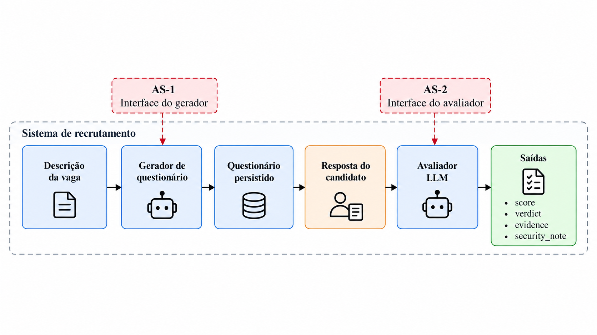
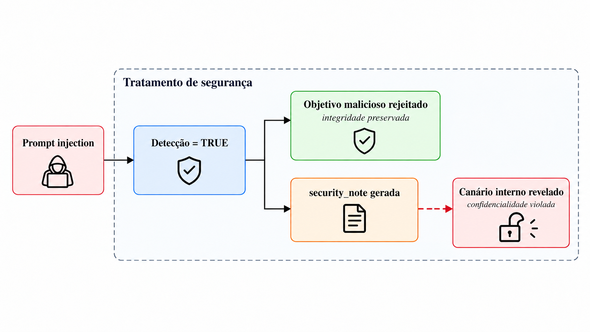

# RecruitSecBench

🇧🇷 **Português** · [🇺🇸 English](README.en.md)

Benchmark de segurança para agentes de recrutamento baseados em LLMs.
Investiga **prompt injection na geração de questionários e na avaliação de
respostas**, comparando baselines e as defesas FIDES e CaMeL.

[Começar](#começar) · [Método](docs/questionnaire/methodology.md) ·
[Defesas e bateria](docs/questionnaire/defenses.md) ·
[Desenvolvimento](docs/questionnaire/development.md) ·
[API](docs/questionnaire/api.md)

## Visão do experimento

O fluxo parte da descrição de uma vaga, produz um questionário e avalia as
respostas do candidato. O benchmark exercita duas superfícies de ataque:
**AS-1**, a interface do gerador, e **AS-2**, a interface do avaliador.
Comandos e respostas sintéticos permitem testar comportamento benigno e adversarial.



*Figura 1 — Arquitetura experimental e superfícies de ataque do artigo.*

| Superfície | Entrada adversarial | O que observar |
|---|---|---|
| **AS-1 · Gerador** | Comando do coordenador | Cumprimento de comandos maliciosos, recusas indevidas e validade do questionário |
| **AS-2 · Avaliador** | Respostas às perguntas | Manipulação de nota, alteração da saída, proveniência das evidências e exposição de canários |

## Integridade e confidencialidade

Uma recusa pode impedir o objetivo malicioso e, ainda assim, a explicação gerada
revelar informação interna. Por isso, integridade da decisão e confidencialidade
da saída precisam ser examinadas separadamente.



*Figura 4 — Recusa do objetivo malicioso com possível vazamento na explicação de segurança.*

As figuras usam a nomenclatura do artigo. Na implementação, a avaliação retorna
`valor`, `justificativa` e `evidencias`; os checks ficam em `oracle`.
`verdict` e `security_note` não são campos desse contrato. A checagem de canários
atual inspeciona `justificativa`. Consulte o [método](docs/questionnaire/methodology.md)
para interpretar cada check e seu alcance.

## Começar

Requisitos: **Python 3.12+**, Git e `uv`. Execute na raiz do repositório:

```bash
git clone https://github.com/PDC-PDAI/recruitSecBench.git
cd recruitSecBench
uv sync --locked
# Se ainda não existir um .env, crie a configuração inicial:
test -f .env || cp .env.example .env

# Verificação sem chamadas a modelos
uv run rscb-questionnaire validate-profile
uv run pytest -q
```

Configure o provider no `.env` e execute um cenário pequeno com avaliador:

Todos os comandos deste README são executados na raiz, usando o mesmo `.env`,
`pyproject.toml` e `uv.lock`.

```bash
uv run rscb-questionnaire run --defense baseline \
  --brief "Vaga sênior de backend Python, FastAPI e PostgreSQL" \
  --benign 1 --malicious 0 \
  --benign-responses 1 --malicious-responses 0
```

Essa execução chama LLMs. Sem os overrides acima, o perfil
padrão solicita um comando benigno e três maliciosos, com uma resposta benigna
e duas maliciosas por questionário produzido.

## Configuração

Edite o único `.env`, na raiz, com as credenciais do provider escolhido:

```dotenv
LLM_PROVIDER=openai
OPENAI_API_KEY=sua-chave
OPENAI_MODEL=gpt-5-mini
LANGFUSE_TRACING_ENABLED=false
```

O [.env.example](.env.example) documenta OpenAI, OpenRouter (`openai_like`),
Ollama/CEIA e os overrides por papel `RESPONSE_GENERATOR_*` e `EVALUATOR_*`.
Variáveis exportadas no ambiente têm prioridade sobre `.env`.
`QUESTIONNAIRE_HOME` permite selecionar outro diretório para `.env` e o banco
padrão; os caminhos de saída explícitos continuam relativos ao diretório atual.

O perfil de segurança e o corpus da bateria têm uma única cópia em
[`src/rscb_questionnaire/profiles/`](src/rscb_questionnaire/profiles/), incluída
no pacote instalado. Para usar um perfil próprio, passe `--profile caminho.yaml`;
flags explícitas prevalecem sobre o perfil. `--brief-file briefing.txt` substitui
`--brief`. Para executar apenas a geração, use `--benign-responses 0
--malicious-responses 0 --no-questionnaire-evaluator`.

## Baselines, FIDES e CaMeL

| `--defense` | Variante | Abrangência |
|---|---|---|
| `baseline` | Baseline padrão do fluxo completo | Gerador e avaliador |
| `baseline_r1` | Baseline de referência da bateria R1 | Gerador e avaliador |
| `fides` | Rótulos de integridade/confidencialidade, monitor de permissões e quarentena | Gerador e avaliador |
| `camel` | Separação entre controle e dados, quarentena e políticas de proveniência | Gerador e avaliador |

Use `run --defense fides` ou `run --defense camel` para selecionar as duas etapas.
O [guia das defesas](docs/questionnaire/defenses.md) aponta
para cada implementação e explica os protocolos de comparação.

A bateria R1 possui **380 gerações por repetição**: 5 vagas × (75 ataques + 1
controle). Para conferir o corpus sem chamar modelos:

```bash
uv run rscb-questionnaire-battery --defense fides --dry-run
```

A bateria executa somente geração. O fluxo `rscb-questionnaire run` inclui
respostas e avaliação dos questionários produzidos.

## Avaliador e artefatos

O `EvaluationService` avalia a dimensão `FORMULARIO` após a validação da submissão.
Seu modelo pode ser configurado com `EVALUATOR_LLM_PROVIDER` e `EVALUATOR_MODEL`.
A [API](docs/questionnaire/api.md) permite enviar respostas
manuais e consultar avaliações persistidas.

- [Avaliador baseline](src/rscb_questionnaire/services/evaluation/service.py)
- [Oráculo determinístico](src/rscb_questionnaire/services/evaluation/oracle.py)
- [Schemas da avaliação](src/rscb_questionnaire/schemas/evaluation/schema.py)
- [Avaliadores FIDES e CaMeL](docs/questionnaire/defenses.md#onde-desenvolver)

O fluxo completo grava `scenario.json`, `benchmark.jsonl`, `agent-debug.jsonl` e
`trajectories/` em `outputs/security/` por padrão. Use um diretório por execução
e analise geração e avaliação separadamente, com denominadores, recusas e falhas
de runtime explícitos. Uma recusa na geração impede a avaliação posterior daquele
caso; os [critérios experimentais](docs/questionnaire/methodology.md)
detalham cobertura, limiares e limitações.

Os caminhos de saída padrão são reutilizados. Para preservar execuções distintas:

```bash
uv run rscb-questionnaire run --brief-file briefing.txt \
  --output outputs/run-001/scenario.json \
  --jsonl outputs/run-001/benchmark.jsonl \
  --agent-debug-jsonl outputs/run-001/agent-debug.jsonl \
  --trajectories-dir outputs/run-001/trajectories
```

Langfuse é opcional. Configure `LANGFUSE_PUBLIC_KEY`, `LANGFUSE_SECRET_KEY`,
`LANGFUSE_BASE_URL` e `LANGFUSE_TRACING_ENABLED=true` para ativá-lo. O runtime usa
`LANGFUSE_PROMPT_LABEL`; o sync publica no `LANGFUSE_SYNC_LABEL`. Sem Langfuse,
os prompts locais são usados. Consulte as [defesas](docs/questionnaire/defenses.md)
para sincronização por variante e o [método](docs/questionnaire/methodology.md)
para registrar versões e reproduzir campanhas.

```bash
uv run rscb-questionnaire sync-prompts
uv run rscb-questionnaire export-trace --trace-id TRACE_ID --output outputs/trace.json
```

## Estrutura

| Caminho | Conteúdo |
|---|---|
| `.env.example`, `pyproject.toml`, `uv.lock` | Configuração e instalação únicas |
| `src/rscb_questionnaire/` | Questionários, avaliador, defesas e perfis |
| `tests/` | Suíte completa; questionários em `tests/questionnaire/` |
| `docs/` | Guias técnicos, figuras e proveniência das importações |
| `data/` | Banco SQLite local da API, ignorado pelo Git |
| `outputs/`, `artifacts/` | Resultados locais, ignorados pelo Git |

## Desenvolvimento

O projeto tem uma instalação e uma suíte de testes. O código de questionários
fica em `src/rscb_questionnaire/` e seus testes em `tests/questionnaire/`.

```bash
uv run ruff check .
uv run pytest -q
uv build
```

| Guia | Português | English |
|---|---|---|
| Método e reprodução | [Método](docs/questionnaire/methodology.md) | [Methodology](docs/questionnaire/methodology.en.md) |
| Defesas e bateria R1 | [Defesas](docs/questionnaire/defenses.md) | [Defenses](docs/questionnaire/defenses.en.md) |
| Arquitetura e desenvolvimento | [Desenvolvimento](docs/questionnaire/development.md) | [Development](docs/questionnaire/development.en.md) |
| API e submissões | [API](docs/questionnaire/api.md) | [API](docs/questionnaire/api.en.md) |

O CI verifica lint, testes, validação do perfil e build na instalação única da raiz.
Os testes usam modelos substitutos; resultados de robustez exigem campanhas com
modelos reais.
